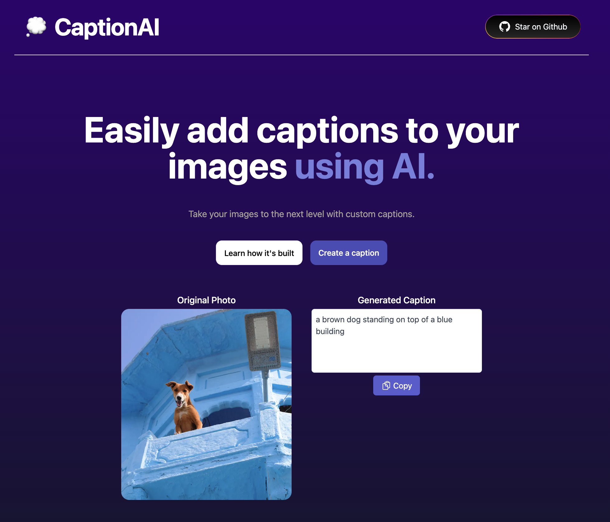

# [CaptionAI](https://captionai.vercel.app/)
Software as a Service (SaaS) Platform leveraging the capabilities of GPT (Generative Pre-trained Transformer) technology. Generate the metadata/description and text response to the validity of picture.  

## 🗒️ A stract

1. **Metadata/Description Generation**: The SaaS platform utilizes GPT technology to generate comprehensive metadata and descriptions for uploaded images, enhancing content understanding and discoverability [[1](https://aws.amazon.com/what-is/gpt/)].

2. **Validity Assessment of Pictures**: By leveraging GPT's capabilities, the platform analyzes uploaded images to assess their validity, providing insights into whether the content is authentic, manipulated, or potentially misleading. This assessment aids users in making informed decisions based on the credibility of the visual content [[4](https://www.linkedin.com/pulse/generative-pre-trained-transformer-gpt-enterprise-akheleash-raghuram)].


[](https://captionai.vercel.app/)

## How it works
Developed this using [this template.](https://github.com/Nutlope/restorePhotos/tree/1c5c8ac4f52a08f68a3091d3b21be8a65aef71f2)

It uses an ML model from salesforce called [BLIP](https://github.com/salesforce/BLIP) on [Replicate](https://replicate.com/) to convert images into text. This application gives you the ability to upload any photo, which will send it through this ML Model using a Next.js API route, and return your caption.

## Running Locally

### Cloning the repository the local machine.

```bash
git clone
```

### Creating a account on Replicate to get an API key.

1. Go to [Replicate](https://replicate.com/) to make an account.
2. Click on your profile picture in the top right corner, and click on "Dashboard".
3. Click on "Account" in the navbar. And, here you can find your API token, copy it.

### Storing API key in .env file.

Create a file in root directory of project with env. And store your API key in it, as shown in the .example.env file.

If you'd also like to do rate limiting, create an account on UpStash, create a Redis database, and populate the two environment variables in `.env` as well. If you don't want to do rate limiting, you don't need to make any changes.

### Installing the dependencies.

```bash
npm install
```

### Running the application.

Then, run the application in the command line and it will be available at `http://localhost:3000`.

```bash
npm run dev
```
 
## Deploy

When deploying on Vercel also include the Environmentable Variables.

## Powered by

This example is powered by the following 3 services:

- [Replicate](https://replicate.com) (AI API)
- [Upload](https://upload.io) (storage)
- [Upstash Redis](https://docs.upstash.com/redis) (Rate Limiting)
- [Vercel](https://vercel.com) (hosting, serverless functions, analytics)
- [convex1](https://stack.convex.dev/full-stack-chatgpt-app)
- [convex2](https://dashboard.convex.dev/t/jookie)

## 🌐 Sources
1. [aws.amazon.com - What is GPT AI?](https://aws.amazon.com/what-is/gpt/)
2. [linkedin.com - Generative Pre-trained Transformer (GPT) for Enterprise](https://www.linkedin.com/pulse/generative-pre-trained-transformer-gpt-enterprise-akheleash-raghuram)
